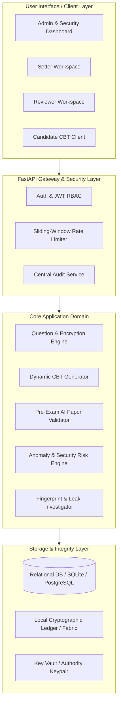

# System Architecture Documentation

## Overview
The **Secure Dynamic Examination Paper & CBT Integrity System** is designed with a defense-in-depth security model to eliminate common vectors of examination compromise, question leaks, unauthorized session access, and audit tampering.

---

## Architectural Principles
1. **Least Privilege Scoping**: Question setters work exclusively on individual questions. No single setter or reviewer has visibility into the complete examination paper.
2. **Envelope Encryption**: Questions and answers are encrypted using AES-256-GCM symmetric data keys (DEK), wrapped with RSA-OAEP public keys before persistence.
3. **Immutable Audit Ledger**: Every question lifecycle step, approval, exam release, session event, and exposure is chained into an append-only cryptographic ledger (with Hyperledger Fabric gateway support).
4. **Just-in-Time CBT Delivery**: Questions are dynamically selected from verified pools according to blueprint criteria and delivered single-question-at-a-time to bound, authenticated candidate devices.

---

## System Component Diagram

---

## Service Boundaries
- **`app/routes/auth.py`**: User registration, role-aware JWT authentication.
- **`app/routes/questions.py`**: Question authoring, assigned reviews, status transitions.
- **`app/routes/exams.py`**: Exam blueprint management, release approvals, CBT session lifecycle, JIT question delivery, answer logging.
- **`app/routes/fingerprints.py`**: Question and exam paper SHA-256 fingerprint generation & cryptographic matching.
- **`app/routes/investigation.py`**: Suspected leak text matching, similarity analysis, and visual chain of custody timeline.
- **`app/routes/security.py`**: Security alert management and event scoring.
- **`app/routes/identity.py`**: Examination centre registration, device token binding, candidate identity verification.
- **`app/blockchain/`**: Dual-mode ledger abstraction (Local Ledger / Fabric Gateway).
